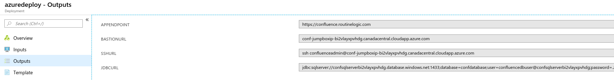

# Atlassian Confluence Data Center

Confluence Data Center gives you uninterrupted access to Confluence with performance at scale, disaster recovery and instant scalability when hosting our applications in your Azure private cloud account.

## Confluence Architecture

The original version of the Azure templates created a standalone Synchrony cluster as part of the deployment. These templates follow the now recommended approach of letting Confluence manage Synchrony for you. This will reduce setup maintenance and cost. For more information see the [Set up a Synchrony Cluster for Confluence Data Center](https://confluence.atlassian.com/display/DOC/Set+up+a+Synchrony+cluster+for+Confluence+Data+Center) article.

## Deploy to Azure Portal

NB. The current Azure deployment utilises certain Azure functionality like App Insights, Azure Monitoring, SQL Analytics, Premium Files etc that are still in Preview mode and not available in some regions. To ensure you can utilise these technologies deploy into the following regions:  

1. Australia East
2. Australia Southeast
3. Canada Central
4. Central US
5. East Asia
6. East US 2
7. East US
8. Japan East
9. Korea Central
10. North Europe
11. South Central US
12. Southeast Asia
13. UK South
14. West Europe
15. West US 2
16. West US

You can of course disable App Insights, Analytics etc via the template parameters to allow installation to your desired region.  

NB That the templates will download the latest version available from Atlassian Download site. These new releases might introduce breaking changes but you can always specify particular version by updating the confluenceVersion parameter.

Further information on parameters and other installation options for the Atlassian Azure solution can be found at our [Confluence Azure Support Page](https://confluence.atlassian.com/doc/getting-started-with-confluence-data-center-on-azure-937176452.html)  

## View Azure Deployment Results

View deployment output values in Azure Portal for endpoints, DB url etc.  

