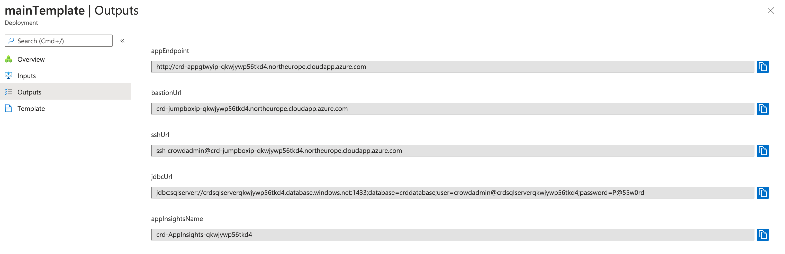

# Atlassian Crowd Software Data Center

Crowd Software Data Center gives you uninterrupted access to Crowd Software with performance at scale, disaster recovery and instant scalability when hosting our applications in your Azure private cloud account.

## Deploy to Azure Portal
Deploy via the Azure Marketplace, search for *Crowd Software Data Center*

NB. The current Azure deployment utilises certain Azure functionality like App Insights, Azure Monitoring, SQL Analytics, Premium Files etc that are still in Preview mode and not available in some regions. To ensure you can utilise these technologies deploy into the following regions:  

1. Australia East
2. Australia Southeast
3. Canada Central
4. Central US
5. East Asia
6. East US 2
7. East US
8. Japan East
9. Korea Central
10. North Europe
11. South Central US
12. Southeast Asia
13. UK South
14. West Europe
15. West US 2
16. West US

You can of course disable App Insights, Analytics etc via the template parameters to allow installation to your desired region.  

NB That the templates will download the latest version available from Atlassian Download site.

Further information on parameters and other installation options for the Atlassian Azure solution can be found at our [Running Crowd on Azure page](https://confluence.atlassian.com/display/ENTERPRISE/Running+Crowd+on+an+Azure+cluster)  

## View Azure Deployment Results

View deployment output values in Azure Portal for endpoints, DB url etc.  

